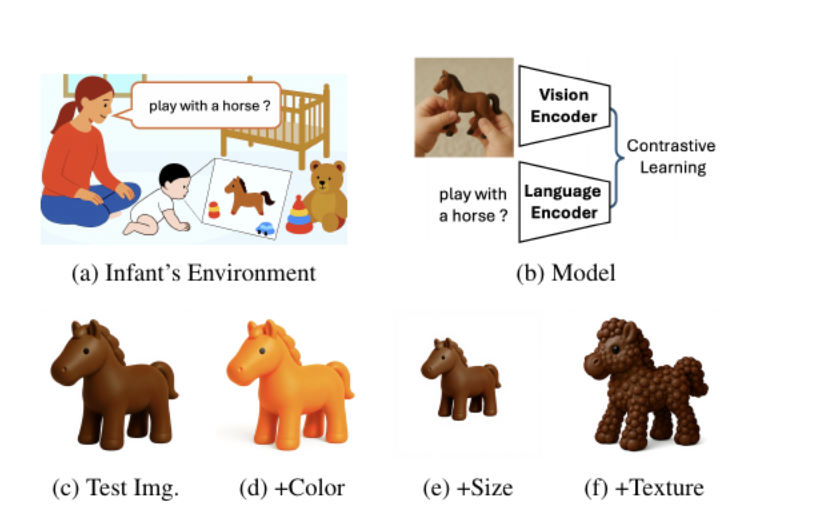

# Benchmarking Attribute Discrimination in Infant-Scale Vision-Language Models

<p align="center"><b>Official repository for our CVPR COGVL Workshop 2026 paper</b></p>

<p align="center">
  Patrick Batsell, Satoshi Tsutsui, and Bihan Wen
</p>

<p align="center">
  Rice University and Nanyang Technological University
</p>

<p align="center">
  <a href="Paper/Benchmarking_Attribute_Discrimination_in_Infant_Scale_Vision_Language_Models.pdf">Paper PDF</a>
  ·
  <a href="#setup">Setup</a>
  ·
  <a href="#running-the-benchmark">Run the Benchmark</a>
  ·
  <a href="#citation">Citation</a>
</p>

<p align="center">
  
</p>

## Overview

This repo studies a simple but important question: infant-scale vision-language models can recognize objects, but do they also encode the visual attributes that distinguish objects within the same category?

To test that, we build a controlled benchmark for **color**, **size**, and **texture** discrimination. The benchmark combines a synthetic dataset with tightly controlled attribute variation and a real-image validation set from **KonkLab**. We compare infant-trained models like **CVCL** against web-scale models like **CLIP** and **SigLIP**, as well as DINO and supervised ImageNet baselines.

If you are here for the main takeaway: **infant-scale training produces strong object recognition and surprisingly solid size discrimination, but color remains a major weakness without large-scale text supervision.**

## Highlights

- CVCL and infant-trained DINO are both strong on **object class discrimination**, but both struggle badly on **color discrimination**.
- Web-scale vision-language models are strong on both **class** and **color**, especially in zero-shot text-image matching.
- The same pattern holds on **real photographs** from KonkLab, not just on synthetic renders.
- All forced-choice tasks use a **4-way setup**, so chance performance is **25%**.

### Headline Results

These numbers come from the summary CSVs in `experiments/Chart_Generation/`.

#### Prototype-Based Class Discrimination

| Model | Synthetic | Real (KonkLab) |
| --- | ---: | ---: |
| CVCL | 85.0% | 86.6% |
| DINO (Infant) | 85.4% | 87.9% |
| DINO (ImageNet) | 98.7% | 95.2% |
| CLIP | 98.7% | 98.4% |
| SigLIP | 100.0% | 99.0% |
| ResNeXt | 98.2% | 99.0% |

#### Prototype-Based Attribute Discrimination

| Model | Color | Size | Texture |
| --- | ---: | ---: | ---: |
| CVCL | 19.0% | 62.6% | 90.1% |
| DINO (Infant) | 21.0% | 64.2% | 90.7% |
| DINO (ImageNet) | 25.9% | 56.3% | 93.1% |
| CLIP | 67.2% | 50.5% | 90.3% |
| SigLIP | 53.4% | 35.9% | 89.0% |
| ResNeXt | 47.1% | 48.5% | 88.3% |

#### Text-Vision Matching

| Model | Class (Synthetic) | Class (Real) | Color | Size |
| --- | ---: | ---: | ---: | ---: |
| CVCL | 29.0% | 35.4% | 11.6% | 36.4% |
| CLIP | 95.8% | 99.0% | 98.6% | 44.1% |
| SigLIP | 99.0% | 99.8% | 99.0% | 42.8% |

## Benchmark

The synthetic benchmark is designed to isolate visual attributes while keeping everything else controlled.

- **67 object classes**
- **9 colors**
- **3 sizes**
- **2 textures**
- **7,236 total images**

Each object is rendered on a plain white background with systematic attribute variation. The benchmark supports two complementary evaluation settings:

1. **Prototype-based evaluation**
   Compare image embeddings against an averaged class or attribute prototype.
2. **Text-vision evaluation**
   Match text prompts like `red ball` directly against candidate images.

The repo also includes **KonkLab** real-image validation to check whether the synthetic trends transfer beyond generated images.

## Models Evaluated

| Model | Training Data | Text Encoder |
| --- | --- | --- |
| CVCL | ~37K infant egocentric frames from SAYCam | Yes |
| DINO (Infant) | SAYCam S subset | No |
| DINO (ImageNet) | ImageNet-1K | No |
| CLIP | 400M web image-text pairs | Yes |
| SigLIP | Web-scale image-text pairs | Yes |
| ResNeXt | ImageNet-1K supervised training | No |

## Repo Layout

```text
experiments/                 Main experiment entrypoints
experiments/Chart_Generation Result CSVs and figure generation
src/                         Model loading and feature extraction utilities
data/                        Synthetic benchmark, KonkLab, and overlap files
Paper/                       Paper PDF and README preview asset
scripts/                     Dataset download and environment checks
```

## Setup

If you want to reproduce the benchmark from scratch:

```bash
conda env create -f environment.yml
conda activate ntu-synthetic
python -m spacy download en_core_web_sm
pip install -e discover-hidden-visual-concepts/
python scripts/download_konklab_dataset.py
python scripts/download_synthetic_dataset.py
python scripts/test_environment.py
```

## Running the Benchmark

Run everything from the repo root unless noted otherwise.

### Prototype-Based Evaluation

```bash
cd experiments

python run_prototype_class.py --num_trials 4000 --seeds 0 1 2
python run_prototype_class_konklab.py --num_trials 4000 --seeds 0 1 2

python run_prototype_color.py --n_seeds 3 --trials_per_class 500
python run_prototype_size.py --n_seeds 3 --trials_per_class 500
python run_prototype_texture.py --n_seeds 3 --trials_per_class 500
```

### Text-Vision Evaluation

```bash
cd experiments

python run_textvision_class.py --num_trials 4000 --seeds 0 1 2
python run_textvision_class_konklab.py --num_trials 4000 --seeds 0 1 2

python run_textvision_color.py --n_seeds 3 --trials_per_class 500
python run_textvision_size.py --n_seeds 3 --trials_per_class 500
```

### Additional Analysis

```bash
cd experiments
python run_synonym_sensitivity.py
```

### Generate Paper Figures

```bash
cd experiments/Chart_Generation
python generate_all_figures.py
python generate_all_figures.py --fig 3
```

## Notes

- Prototype class and text-vision class scripts use `--num_trials` and `--seeds`.
- Attribute-focused scripts use `--trials_per_class` and `--n_seeds`.
- Result summaries are written to `experiments/Chart_Generation/`.
- The paper PDF is included locally at `Paper/Benchmarking_Attribute_Discrimination_in_Infant_Scale_Vision_Language_Models.pdf`.

## Citation

If you use this repo, benchmark, or results, please cite:

```bibtex
@inproceedings{batsell2026attribute,
  title     = {Benchmarking Attribute Discrimination in Infant-Scale Vision-Language Models},
  author    = {Batsell, Patrick and Tsutsui, Satoshi and Wen, Bihan},
  booktitle = {CVPR COGVL Workshop},
  year      = {2026}
}
```

## Acknowledgments

This project builds on the CVCL codebase and the earlier
[`discover-hidden-visual-concepts`](discover-hidden-visual-concepts) framework.
